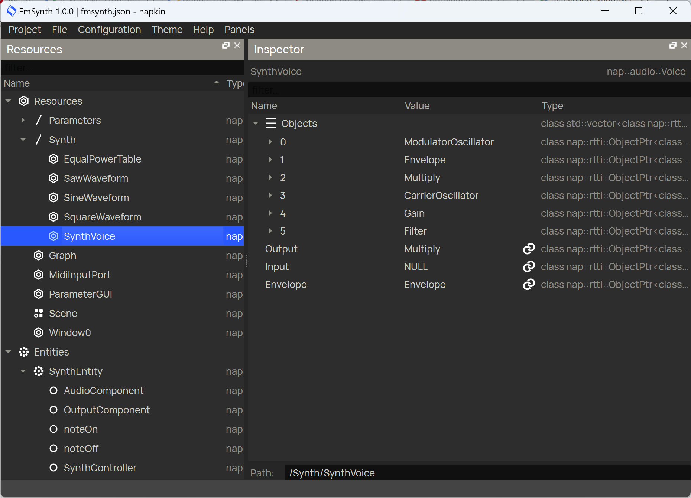

# Description

This module adds an extensive audio processing and synthesis toolkit on top of the napaudio module. It allows you to design audio processing patches in Napkin and expand the number of processed audio channels easily. Audio patches can be wrapped in a polyphonic system, so different voices of the same patch can sound simultaneously while independently being manipulated in realtime.

# Installation
Compatible with NAP 0.6 and higher - [package release](https://github.com/napframework/nap/releases) and [source](https://github.com/napframework/nap) context.

### From ZIP

[Download](https://github.com/naivisoftware/napopencv/archive/refs/heads/main.zip) the module as .zip archive and install it into the nap `modules` directory:
```
cd tools
./install_module.sh ~/Downloads/napopencv-main.zip
```

### From Repository

Clone the repository and setup the module in the nap `modules` directory.

```
cd modules
clone https://github.com/naivisoftware/napopencv.git
./../tools/setup_module.sh napopencv
```

# Demo

<p align="center">
  
</p>
