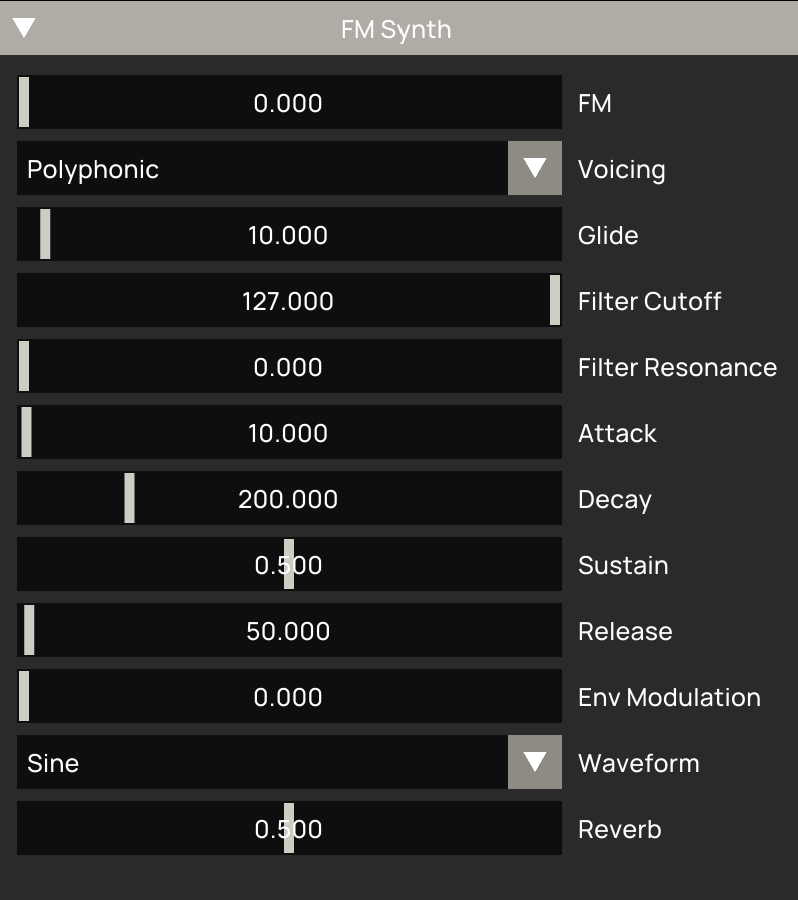
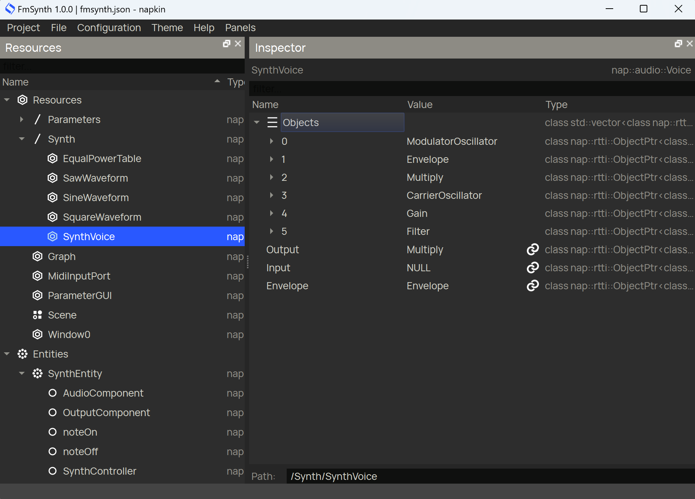

# 3. FM synth demo

  

The demo application that comes with this module is a rather classic polyphonic FM synthesizer that can be played using a midi controller or using the character keys of your PC keyboard. Its main components are a modulator and a carrier oscillator, a lowpass filter and an ADSR envelope to modulate both the carrier oscillator's amplitude and the filter cutoff frequency.

There is a selection of parameters that can be used to control the ADSR envelope shape, the filter cutoff frequency, resonance and envelope modulation, the amount of frequency modulation and the carrier oscillator's waveform.

When polyphonic mode is selected multiple notes can be played at the same time, in monophonic mode overlapping notes follow one another with a portamento effect, controlled by the Glide parameter.

When you open `fmsynth.json` in Napkin (see the image below) the app structure is rather straight forward. The parameters are grouped together. The `SynthVoice` resource contains the DSP patch for each voice. The `Graph` resource contains the main patch with the polyphonic instrument and a master reverb effect.

The `SynthEntity` contains an `AudioComponent` that wraps the `Graph` resource and instantiates it with the component. The `SynthController` component is the heart of the application. It listens to incoming midi note events from the `noteOn` and `noteOff` components, processes them and responds to parameter changes by activating and manipulating voices from the `Polyphonic` object in the `Graph`, which is instanced and managed by the `AudioComponent`.

  

