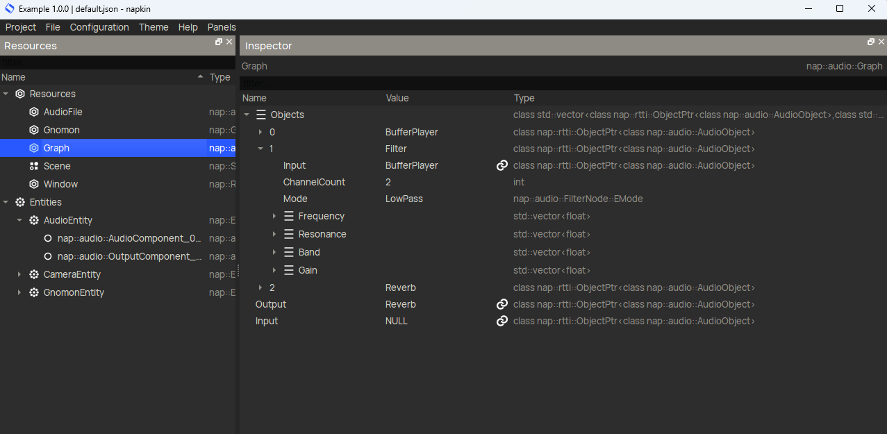

# 2. Getting started

### Linking the module

Once `napaudioadvanced` is installed, the quickest way to try it out is by extending the `example` app that is found in the `apps` folder. Open the project info file called `app.json` and add the module as a dependency:

```
    "RequiredModules": [
        "napexample",
        "napapp",
        "napparametergui",
        "napaudioadvanced"
    ],
```

Once this is done, start napkin and open `example/app.json`. We can see that the `example` app already contains a window, a camera entity and a gnomon entity. (the xyz axis symbol)

<p align="center">
  
</p>

### Adding a DSP graph to your app

Add a `nap::audio::Graph` resource to your app's resources. The `Graph` is the blank canvas to design your audio processing pipeline. The `Graph` has three properties: `Objects`, `Input` and `Output`. The `Objects` property is a vector to which you can add the processing blocks that make up your pipeline. Lets play back an audio file and rout it through a lowpass filter and a reverb. Add a `BufferPlayer`, a `Filter` and a `Reverb47`. Now set the filter's `Input` property to the buffer player and the reverb's `Input` property to the filter. Finally set the graph's `Output` property to the reverb. Now we completed the processing pipeline design.
As you can see Napkin generates unique ID names for all the resources you add. Feel free to change them however you wish, but make sure to call the Filte "Filter", because we will address it from within our code later.

### Adding an audio file

To provide the `BufferPlayer` in the graph with something to play, add a `nap::audio::AudioFileResource` to the app's resources. Copy the audio file `demos/audioplayback/data/hang.mp3` (or any other audio file) to the `apps/example/data` directory, and make the `AudioFilePath` property in the `AudioFileResource` point to it. Finally make the `Buffer` property in the `BufferPlayer` in the `Graph` point to the `AudioFileResource`.

### Process the graph and rout it to the audio device

The audio graph that we specified can be seen as only a design for the actual processing code. In order to put it to use we have to instantiate the graph resource. (a common design pattern throughout NAP) We do so by creating an entity, let's call it `Audio`, and add an `audio::AudioComponent` and an `audio::OutputComponent`. Double click on the `Object` property within the `AudioComponent` and create a `audio::GraphObject`. Make its `Graph` property point to our graph resource. Make the `Input` property of the `OutputComponent` point to the `AudioComponent`. Finally, add the `AudioEntity` to the app's `Scene` on the scene panel in Napkin.

<p><b>What does this all mean?</b>

The `AudioComponent` manages and instances any subclass of `AudioObject`. AudioObjects are objects that (much like Components) have a resource and instance counterpart. The `audio::GraphObject` within the AudioComponent is an `AudioObject` that manages a `Graph`, but all objects within the graph are in turn AudioObjects as well. This allows the nesting of graphs.

### Running the app

We are now ready to save our project in Napkin, run the example app and listen to the audio processing pipeline we just designed! This should all work without programming a single line of code.

### Multichannel expansion

You will notice that only one output channel of your audio device is sounding though, which can be quite disheartening when working in stereo. This is easily solved by looking at the `ChannelCount` properties of the AudioObjects within the graph. When we change their values to 2 you will hear a stereo signal. Most AudioObjects are capable of processing any number of channels.
</p>
<i>Note: some properties of the Filter are vectors so a different value can be specified for each channel, optionally.</i>

### Adding a slider

Let's write some code!

Say we want to add a slider that controls the cutoff frequency of the lowpass filter in our audio processing graph. First create a member variable in our app's private section that holds the value of the cutoff frequency slider:

```C++
private:
    float mFrequency = 1000.f;
```

Then add some code to the implementation of the app's update method:

```C++
// Show the cutoff frequency slider
ImGui::Begin("Audio example", nullptr, ImGuiWindowFlags_AlwaysAutoResize);
if (ImGui::SliderFloat("Cutoff Frequency", &mFrequency, 20.f, 22000.f, "%.3f", 4.f))
{
    // Get the filter from the audio graph within the audio component
    auto audioEntity = mScene->findEntity("AudioEntity");
    auto audioComponent = audioEntity->findComponent<audio::AudioComponentInstance>();
    auto graphObject = audioComponent->getObject<audio::GraphObjectInstance>();
    auto filter = graphObject->getObject<audio::FilterInstance>("Filter");

    // Update the filter cutoff frequency for each channel
    for (auto channel = 0; channel < filter->getChannelCount(); ++channel)
        filter->getChannel(channel)->setFrequency(mFrequency);
}
ImGui::End();
```

This code creates a small GUI window with a slider for the cutoff frequency. When the user moves the slider, the filter object is fetched from the audio graph that is managed by the AudioComponent. Finally the cutoff frequency is updated for each channel of the filter.

<i>Note: it is not best practice to look up the filter object every update loop. Better is to move this logic to a custom sibling component of the `AudioComponent`. The purpose of this chapter though is to give a quick impression how to work with napaudioadvanced. For a more elaborate example, check out the demo!</i> 
